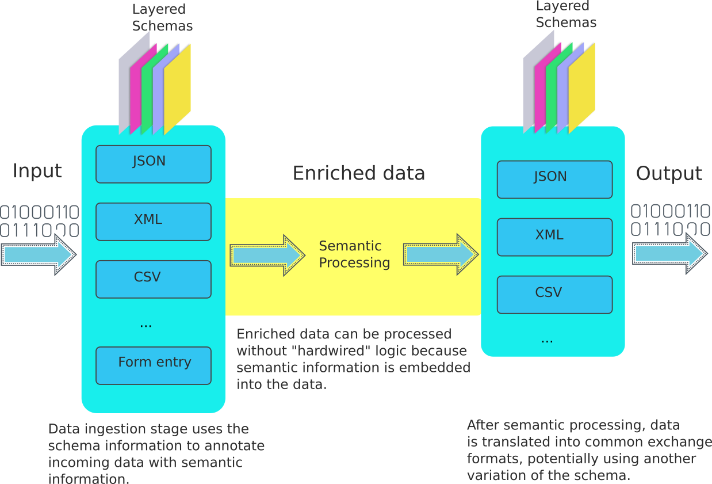

# Layered Schemas

Layered schema architecture is developed work with unified data
semantics regardless of the data capture locale, data representation,
format, or terminology. Traditional schemas (such as JSON/XML schemas)
describe the structure of data with limited semantic
information. Layered schemas use structural constraints similar to
traditional schemas and open-ended semantic annotations to describe
data. Some elements of a layered schema are:

  * Constraints: Required attributes, length limits,...
  * Format: Phone number with area code, date/time,...
  * Language: English, Spanish,...
  * Privacy classifications: Personally identifiable information, sensitive information,...
  * Retention policies: Attributes must be cleared after a period,...
  * Provenance: Data source, signatures, ...

A schema can be "sliced" into multiple layers with each layer
including only some of the annotations. These layers can be replaced
with other layers representing variations in stuctural constraints,
different languages or notationan differences based on locale,
different security constraints based on context, etc.

Using a layered schema, data objects can be "ingested". The input of
the adapter is a representation format such as JSON, CSV, or XML. The
output is a JSON-LD document containing data elements and schema
annotations. An application can perform semantic processing using this
JSON-LD document without knowing the input representation. After
processing data, the application can generate output using another
layered schema. 



For instance, an application can ingest tabular data from a CSV file,
and then generate a verifiable credential document. Same application
can also ingest a JSON data object using the same terms to generate a
verifiable credential using the same logic.

Use-cases for layered schemas include:

  * **Data entry:** A layered schema can include overlays that have
    information to auto-generate data entry forms. These can be
    locale-specific overlays including valid options, entry format, UI
    labels and help text, etc.
  * **Data ingestion:** Semantics for data coming from multiple
    sources (APIs, file uploads, data entrty) can be defined using a
    unified vocabulary at the schema bases, and source-specific
    variations can be implemented as different sets of overlays.
  * **Granular privacy/security controls** Different privacy/security
    classifications can be applied to data elements based on the
    overlays used. For instance, data elements with a certain privacy
    classification can be masked in one context, and left untouched in
    another context. 
  * **De-identification** Attributes that might reveal the identity of
    data subjects can be removed from the data. Using different
    overlays, the set of attributes that will be removed from the data
    can be controlled.
  

## Example Operation

A layered schema is a JSON-LD document. It describes the structure of
an object and semantic information for its data elements. Most of the
information/constraints encoded in JSON/XML schemas or CSV files can
be represented using layered schemas.

Consider this JSON schema:

```
{
  "type": "object",
  "properties": {
     "link": {
        "type": "string",
        "format": "uri"
     },
     "num": {
        "type" "number"
    }
  }
}
```

An equivalent layered schema is as follows:

```
{
  "@context": "http://schemas.cloudprivacylabs.com/layers.jsonld",
  "@type": "Layer",               // mark this object as a schema layer
  "objectType": "TestObject",     // Name of the object defined by the schema
  "attributes": {                 // Attributes of the objec
    "id1": {                      // Attribute id
       "attributeName": "link",   // Name of the attribute
       "type": "string",          // Type of the attribute (annotation)
       "format": "uri"            // Format of the attribute (annotation)
    },
    "id2": {                      // Attribute id
       "attributeName": "num",    // Name of the attribute
       "type": "number"           // Type of the attribute (annotation)
    }
  }
}
```

We can slice this schema into three layers:
```
// Base layer - structure
{
  "@context": "http://schemas.cloudprivacylabs.com/layers.jsonld",
  "@type": "Layer",
  "objectType": "TestObject",
  "attributes": {
    "id1": {
       "attributeName": "link"
    },
    "id2": {
       "attributeName": "num"
    }
  }
}

// Type layer
{
  "@context": "http://schemas.cloudprivacylabs.com/layers.jsonld",
  "@type": "Layer",
  "objectType": "TestObject",
  "attributes": {
    "id1": {
       "type": "string"
    },
    "id2": {
       "type": "number"
    }
  }
}

// Format layer
{
  "@context": "http://schemas.cloudprivacylabs.com/layers.jsonld",
  "@type": "Layer",
  "objectType": "TestObject",
  "attributes": {
    "id1": {
       "format": "uri"
    }
  }
}
```

The composition of these three layers is the original schema.

Suppose we ingest a data object using this schema:

```
{
  "link": "http://example.com?id=12345",
  "num": 1,
  "extraField": "test"
}
```

When ingested, this data object will be annotated using schema attributes:

```
{
  "attributes": {
    "TestObject.link": {                      // Generated attribute ID
     "attributeId": "id1"                     // Link to schema attribute
     "attributeName": "link",                 // Name of the attribute in the input
     "type": "string",                        // Annotation embedded from the schema
     "format": "uri",                         // Annotation embedded from the schema
     "value": "http://example.com?id=12345",  // Value of the attribute
    },
    "TestObject.num": {
     "attributeId": "id2"
     "attributeName": "num",
     "type": "number",
     "value": 1,
    },
    "TestObject.extraField": {                // This field does not exist in the schema
                                              // so there are no schema annotations
     "value": "test",                         // Value of the attribute
     "attributeName": "extraField"            // Name of the attribute
    }
}
```

We can add a new layer to mark the first attribute with `PII`
(personally identifiable information)` flag:

```
{
  "@context": "http://schemas.cloudprivacylabs.com/layers.jsonld",
  "@type": "Layer",
  "attributes": {
    "id1": {
       "privacyClassification": "PII"
    }
  }
}
```

Then the ingested document becomes:

```
{
  "attributes": {
    "TestObject.link": {
     "attributeId": "id1"
     "attributeName": "link",
     "type": "string",
     "format": "uri",
     "privacyClassification" "PII",            // New annotation from the added layer
     "value": "http://example.com?id=12345",
    },
  ...
```

An application can select all attributes containing `PII` in
`privacyClassifications` and set their values to `null` to
de-identify a data object.

## Schemas Layers

The format of a schema layer is as follows:

```
{
  "@context": "http://schemas.cloudprivacylabs.com/layers.jsonld",
  "@type": "Layer",
  "@id": "http://example.org/someEntity/base",
  "objectType": "someEntity",
  "attributes": {
    "key1": {},
    "key2": {
      "attributes": {
         "key2_1": {}
      }
    },
    "key3": {
      "privacyClassifications": ["https://someOntology/PII"]
    },
    "array": {
      "arrayItems": {
         "type": "string"
      }
    },
    ...
  ],
  
}
```


  * @type: This is a Layer document
  * @id: The ID for the layer
  * objectType: The object described by this layer.

### @context

The @context defines several types and terms. Each term has specific
semantics and algorithms associated with it.

`Layer` type is used to describe a schema layer. 

 * objectType: This is the entity type defined by the schema base
 
```
        "Layer": {
            "@id": "http://schemas.cloudprivacylabs.com/Layer",
            "@context": {
                "@version": 1.1,
                "objectType": {
                    "@id": "http://schemas.cloudprivacylabs.com/Schema/objectType",
                    "@type": "@id"
                }
            }
        },

```

`attributes` term is used in schema layers. It defines a nested
attribute structure:

```
"attributes": {
    "@id": "http://schemas.cloudprivacylabs.com/attributes",
    "@container": "@id",
    "@context": {
        "@version": 1.1,
        "attributeName": {  
            "@id": "http://schemas.cloudprivacylabs.com/attribute/name"
        },
        "reference": {
            "@id": "http://schemas.cloudprivacylabs.com/attribute/reference",
            "@type": "@id"
        },  
        "arrayItems": {
            "@id": "http://schemas.cloudprivacylabs.com/attribute/arrayItems",
            "@context": {
                "@version": 1.1,
                "reference": {
                    "@id": "http://schemas.cloudprivacylabs.com/attribute/reference",
                    "@type": "@id"
                },
                "allOf": {
                    "@id": "http://schemas.cloudprivacylabs.com/attribute/allOf",
                    "@container": "@list",
                    "@context": {
                        "@version": 1.1
                    }
                },
                "oneOf": {
                    "@id": "http://schemas.cloudprivacylabs.com/attribute/oneOf",
                    "@container": "@list",
                    "@context": {
                        "@version": 1.1
                    }
                }
            }
        },
        "allOf": {
            "@id": "http://schemas.cloudprivacylabs.com/attribute/allOf",
            "@container": "@list",
            "@context": {
                "@version": 1.1,
                "reference": {
                    "@id": "http://schemas.cloudprivacylabs.com/attribute/reference",
                    "@type": "@id"
                }
            }
        },
        "oneOf": {
            "@id": "http://schemas.cloudprivacylabs.com/attribute/oneOf",
            "@container": "@list",
            "@context": {
                "@version": 1.1,
                "reference": {
                    "@id": "http://schemas.cloudprivacylabs.com/attribute/reference",
                    "@type": "@id"
                }
            }
        }
    }
},
```

  * `@id`: Specifies the id for the attribute. It must be unique in
    the schema it is defined in. 
  * `reference`: Specifies another object referenced by this object
  * `arrayItems`: If the defined attributes is an array, `arrayItems`
    specifies the structure of one element.
  * `allOf`: Specifies composition. The resulting element is the
    combination of the contents of the elements of this term.
  * `oneOf`: Specifies polymorphism. The resulting element is one of
    the elements of this term.
  * `attributeName`: Name of this attribute as it appears in data.
  
```
"privacyClassification": {
    "@id": "http://schemas.cloudprivacylabs.com/attribute/privacyClassification",
    "@container": "@set"
},
"information": {
    "@id": "http://schemas.cloudprivacylabs.com/attribute/information"
},
"encoding": {
    "@id": "http://schemas.cloudprivacylabs.com/attribute/encoding"
},
"type": {
    "@id": "http://schemas.cloudprivacylabs.com/attribute/type"
},
"format": {
    "@id": "http://schemas.cloudprivacylabs.com/attribute/format"
},
"pattern": {
    "@id": "http://schemas.cloudprivacylabs.com/attribute/pattern"
},
"label": {
    "@id": "http://schemas.cloudprivacylabs.com/attribute/label"
},
"enumeration": {
    "@id": "http://schemas.cloudprivacylabs.com/attribute/enumeration",
    "@container": "@list"
},

```
  
  * `privacyClassification`: A set of flags associated with the
    term. Each flag can belong to an ontology that flags this
    attributes. This can be privacy/risk classifications, blinding
    identity, etc.
  * `encoding`: Character encoding for the attribute.
  * `type`: Data type
  * `format`: Expected data format
  * `pattern`: Expected data pattern
  * `label`: Prompt label when constructing a form for this object
  * `information`: Comments
  * `enumeration`: Enumerated options for the attribute

#### Examples

A simple key/value pair is represented as:

```
"attributes": {
   "<key>": {},
   ...
}
```
or

```
"attributes": [
  {
    "@id": "<key>"
  },
  ...
]
```

The `key` is the value assigned to this attribute by the schema
author. Localized names can be given to this key using an overlay with term:

```
{
   "@id": "<key>",
   "attributeName": "name"
}
```

Nested objects can be defined for keys:

```
"attributes": [
  {
    "@id": "name1",
    "attributeName": "name"
  },
  {
    "@id": "obj",
    "attributes": [
       {
         "@id": "name2",
         "attributeName": "name"
       }
    ]
  }
]
```

The above schema defines the following JSON document:

```
{
  "name": "...",
  "obj": {
    "name": "..."
  }
}
```

The `name` and `obj.name` refer to two different attributes with ids
"name1" and "name2" respectively.

An attribute has privacy classification:

```
    {
      "@id": "nfijh9i38ceSa",
      "privacyClassification": ["https://someOntology/PII"]
    }
```

For instance, this can be used to flag PII information based on BIT.

An attribute can be a reference to another schema. References are
open-ended, and they can be a
  
   * Reference using a DRI
   * Reference using target object type
   * Reference using a specific variant of a schema

```
{
   "@id": "patient",
   "reference": "http://someSite/Patient"
}
```

The above defines the field "patient" to be a "Patient" object, whose
schema is given in the `reference` value. This is a reference using
the object type, which does not specify a definite schema, thus an
application specific schema selection must be done. A reference using
a DRI would specify a definite schema.

An attribute can be a nested object:

```
{
   "@id": "nestedObject",
   "attributes": [
      {
        "@id": "nestedAttribute"
      },
      ...
   ]
}
```

An attribute can be an array:

```
{
  "@id": "valueArray",
  "arrayItems": {}
}
```

Instance:

```
"valueArray": [ "value1", "value2", ... ]
```

```
{
  "@id": "objectArray",
  "arrayItems": {
     "attributes": [
        {
          "@id": "key1"
        }
     ]
  }
}
```

Instance:

```
"objectArray": [ 
  { "key1": "value1" },
  { "key2": "value2" }
]
```

An attribute can be the composition of multiple objects:

```
{
  "@id": "p1",
  "allOf": [
    {
      "reference": "http://someObject"
    },
    {
      "attributes": [
        {
           "@id": "attr"
        }
      ]
    }
  ]
}
```

The above construct creates the `p1` attribute by using all
attributes of `http://someobject` and `attr`.

An attribute can be a polymorphic value:

```
{
   "@id": "p2",
   "oneOf": [
     {
      "reference": "http://obj1"
     },
     {
      "reference": "http"//obj2"
     }
    ]
}
```

This describes the `p2` attribute as either `http://obj1` or
`http://obj2`.

## Semantics 

Each term has well-defined semantics that include the meaning and
operations defined for that term. 

### Term: attributes

The term `attributes` is a container where each node with an @id
defines a new attribute. An attribute can be one of:

  * Object: An  `attributes` term defines the nested object structure.
  * Array: An `arrayItems` term defines the structure of each array element.
  * Reference: A `reference` term links to another object. This can be
    a pointer to a schema manifest, or a pointer to an object whose
    schema can be derived based on the current processing context.
  * Composition: An `allOf` term lists the parts of the object
  * Polymorphism: A `oneOf` term lists the possible types.
  * A simple value: If none of the above exists, the value is a simple
    value.
    
The term `attributes` defines a `merge` algorithm that receives two
`attributes` and combines the contents of matching attributes:

Input 1 :
```
"attributes": {
  "k1": {
    "privacyClassification": ["flag1"]
  },
  "k2": {
    "attributes": {
      "k3":{}
    }
  }
}
```

Input 2 :
```
"attributes": {
  "k1": {
    "privacyClassification": [ "flag2" ]
  },
  "k3": {
    "attributeName": "attr3"
  }
}
```
Result:

```
"attributes": {
  "k1": {
    "privacyClassification": [ "flag1", "flag2" ]
  },
  "k2": {
    "attributes": {
      "k3": {
        "attributeName": "attr3"
      }
    }
  }
}
```

During the merge operation:
  * Attributes that are defined as `@set` in the context
    (`privacyClassification`) are combined
  * If a term is defined as `@list`, contents of the second input is
    appended to the first
  * For non-container terms, terms of input1 and input2 are merged,
    with input2 terms overwriting matching input1 terms

## Schemas

A schema specifies one of more schema layers:

```
{
  "@context": "http://schemas.cloudprivacylabs.com/schema.jsonld",
  "@type": "Schema",
  "@id": "schema Id",
  "issuedBy": "...",
  "issuerRole": "...",
  "issuedAt": "...",
  "purpose": "...",
  "classification": "...",
  "objectType": "...",
  "objectVersion": "...",
  "layers": [
     "layer1",
     "layer2",
     ...
   ]
}
```

The schema combined schema layers to create a schema that is
localized, adopted to a particular context/jurisdiction, and
versioned. It defines the entity type specified by the schema
(objectType), the version of the specification (objectVersion), and
optionally, adds a signature by the schema publisher for the schema
users to validate.


