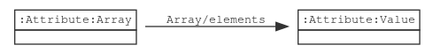

# Array

{}
Term: https://lschema.org/Array
Type: Node label
Use: Schema nodes, ingested data nodes
{}

In a schema, an `Array` node groups an ordered sequence of other
attributes of a fixed type. When data elements are ingested, an
`Array` groups a sequence of data nodes. A JSON array, or a sequence
of repeating XML elements can be represented as an `Array` node. The
structure of the elements of the array is specified by an attribute
node reached through an `Array/elements` edge.

## Schema Model

If a schema node is declared with `ls:Array` label, `ls:Attribute` label is
automatically added.

The `Array` node includes the definition for the root node of the
array. The `Array/elements` edge connects the `Array` node to the
definition of its elements.



## JSON-LD Schema Representation

The following JSON-LD schema fragment shows an `Array` that value attributes:

```
{
  "@type": "Array",
  "@id": "myArrayId",
  "attributeName": "arrayName",
  "arrayElements": {
     "@id": "arrElements",
     "@type": "Value"
   }
}

```

## Ingested Data Model

Data ingestion behavior is controlled by the value of `ls:ingestAs`
property specified in the schema node.

### `ingestAs = node` (default)

TODO

### `ingestAs = edge`

TODO
