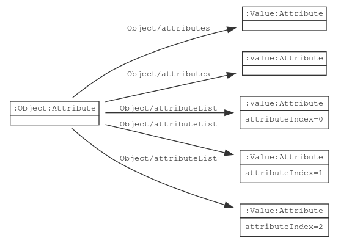
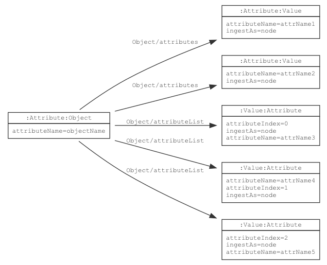
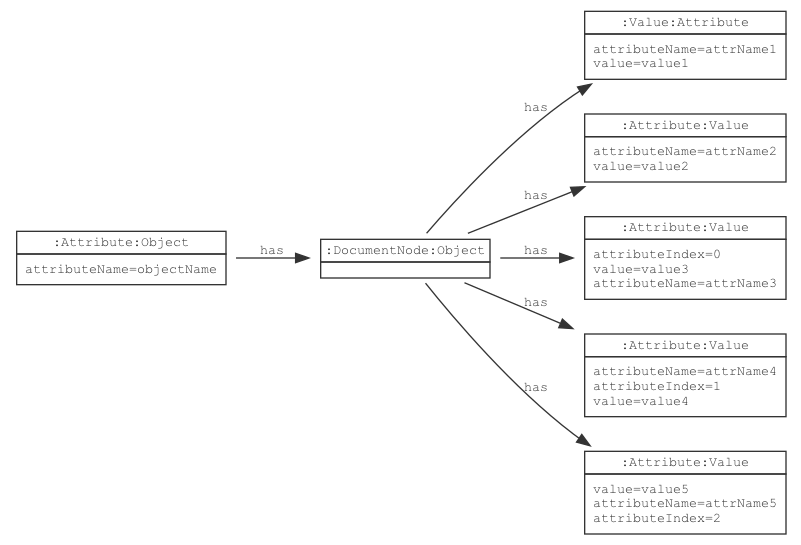
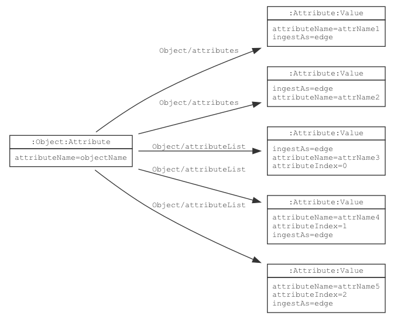
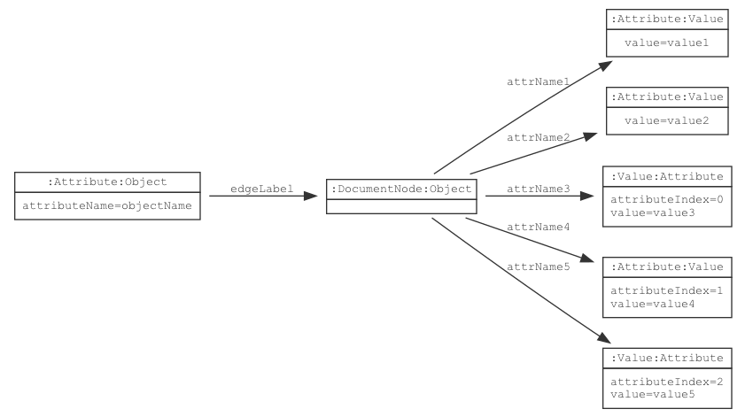

# Object

{}
Term: https://lschema.org/Object
Type: Node label
Use: Schema nodes, ingested data nodes
{}

In a schema, an `Object` node groups a set of other attributes. When
data elements are ingested, an `Object` groups a set of data
nodes. A JSON object containing key-value pairs, or an XML element can
be represented as an `Object` node.

## Schema Model

If a schema node is declared with `ls:Object` label, `ls:Attribute` label is
automatically added.

An `ls:Object` node is linked to its child attributes using
`ls:Object/attributes` or `ls:Object/attributeList` edges. Nodes
connected with `ls:Object/attributes` edges form a set of nodes whose
ordering is not important. Nodes connected with
`ls:Object/attributeList` edges form an ordered sequence of nodes with
`ls:attributeIndex` at each node specifying the order of the
attribute.



## JSON-LD Schema Representation

The following JSON-LD schema fragment shows an `Object` that has an unordered set of attributes:

```
{
  "@type": "Object",
  "@id": "myObjectId",
  "attributeName": "objectName",
  "attributes": {
     "attr1": {
        "@type": "Value"
    },
    "attr2": {
        "@type": "Value
    }
  }
}
```

The following JSON-LD schema fragment shows an `Object` that has an
ordered list of attributes:

```
{
  "@type": "Object",
  "@id": "myObjectId",
  "attributeName": "objectName",
  "attributeList": [
     {
        "@id": "attr1",
        "@type": "Value"
     },
     {
        "@id": "attr2",
        "@type": "Value
    }
  ]
}
```

## Ingested Data Model

Data ingestion behavior is controlled by the value of `ls:ingestAs`
property specified in the schema node.

### `ingestAs = node` (default)

Given the schema: 

If in the schema node, the ingest as property  is specified as `ls:ingestAs=node` then the data ingestion will 
behave as ingesting the object as a node.

Ingesting an `object` as a `node` outputs a 
graph similar to: 
where each parent node contains the edge label "has" to each of its child nodes. 

### `ingestAs = edge`

Given the schema: 

If in the schema node, the ingest as property 
is specified as `ls:ingestAs=edge` then the data ingestion will behave as ingesting the `object` as an `edge`. 

Ingesting an `object` as an `edge` outputs a graph similar to: 
 
where the edge label connecting the parent to the child node, is value of the `attributeName` 
field in the key-value pair of the child node.
