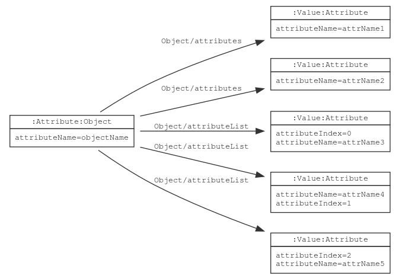

# Object

{}
Term: https://lschema.org/Object
Type: Node label
{}

An object groups a set of nodes. A JSON object containing key-value
pairs, or an XML element can be represented as an `Object` node.

## Schema Model

If a schema node is declared with `ls:Object` label, `ls:Attribute` label is
automatically added.

An `ls:Object` node is linked to its child attributes using
`ls:Object/attributes` or `ls:Object/attributeList` edges. Nodes
connected with `ls:Object/attributes` edges form a set of nodes whose
ordering is not important. Nodes connected with
`ls:Object/attributeList` edges form an ordered sequence of nodes with
`ls:attributeIndex` at each node specifying the order of the
attribute.



## JSON-LD Schema Representation

In a JSON-LD schema, object nodes are written as:

```
{
  "@type": "Object",
  "@id": "myObject",
  "attributes": {
     "attr1": {
        "@type": "Value"
    },
    "attr2": {
        "@type": "Value
    }
  }
}
```

```
{
  "@type": "Object",
  "@id": "myObject",
  "attributeList": [
     {
        "@id": "attr1",
        "@type": "Value"
     },
     {
        "@id": "attr2",
        "@type": "Value
    }
  ]
}
```
