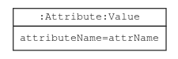
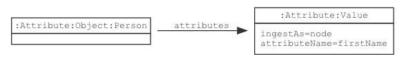
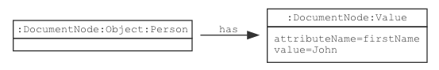
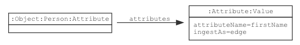
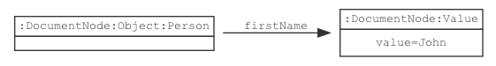

# Value

{}
Term: https://lschema.org/Value
Type: Node label
Use: Schema nodes, ingested data nodes
{}

In a schema, a `Value` node defines an attribute that has a value, or
in some cases, a set of values. A `Value` schema node is a terminal
node with no child attributes. When data elements are ingested, a
`Value` node usually holds the ingested value. A JSON key-value pair,
a JSON array element, an XML attribute, or an XML element with only
text children can be represented as a `Value` node.

## Schema Model

If a schema node is declared with `ls:Value` label, `ls:Attribute` label is
automatically added.



## JSON-LD Schema Representation

The following JSON-LD schema fragment shows a `Value`:

```
{
  "@type": "Value",
  "@id": "myValueIdId",
  "attributeName": "valueName"
}
```

## Ingested Data Model

Data ingestion behavior is controlled by the value of `ls:ingestAs`
property specified in the schema node.

### Ingest Value as Node (default)

Given the schema: 

If in the schema node, the ingest as property  is specified as `ls:ingestAs=node` then the data ingestion will 
behave as ingesting the array as a node. 

Ingesting an array as a `node` outputs a graph similar to:  


where each parent node contains the edge label “has” to each of its child nodes.


### Ingest Value as Edge
Given the schema: 

If in the schema node, the ingest as property 
is specified as `ls:ingestAs=edge` then the data ingestion will behave as ingesting the value as an edge. 

Ingesting a value as an `edge` outputs a graph similar to: 

 

where the edge label connecting the parent to the child node, is value of the `attributeName` 
field in the key-value pair of the child node.
